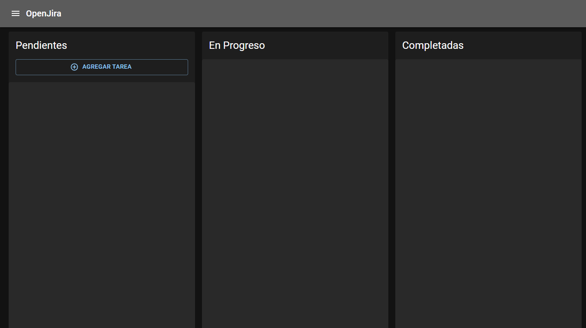

# Next.js OpenJira App



Para correr localmente, se necesita la base de datos
```
docker-compose up -d
```

* El -d, significa __detached__

MongoDB URL Local:
```
mongodb://localhost:27017/entriesdb
```

* Reconstruir los módulos de node y levantar Next
```
yarn install
yarn dev
```


## Configurar las variables de entorno
Renombrar el archivo __.env.template__ a __.env__

## Llenar la base de datos con información de pruebas

Llamar:
```
http://localhost:3000/api/seed
```


